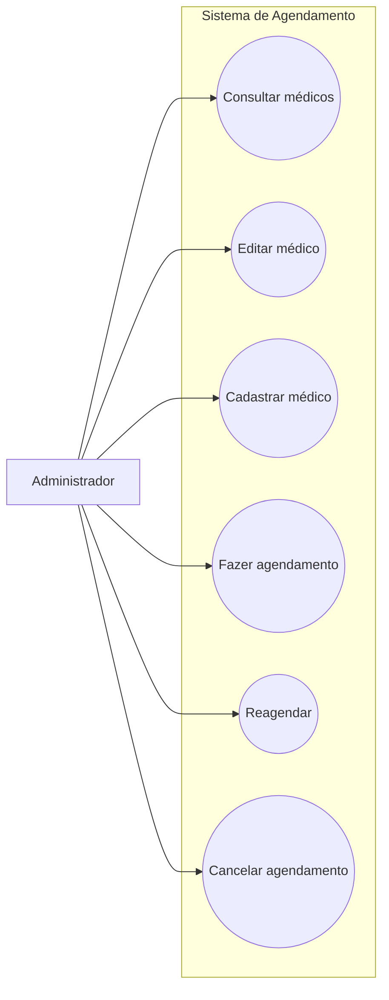
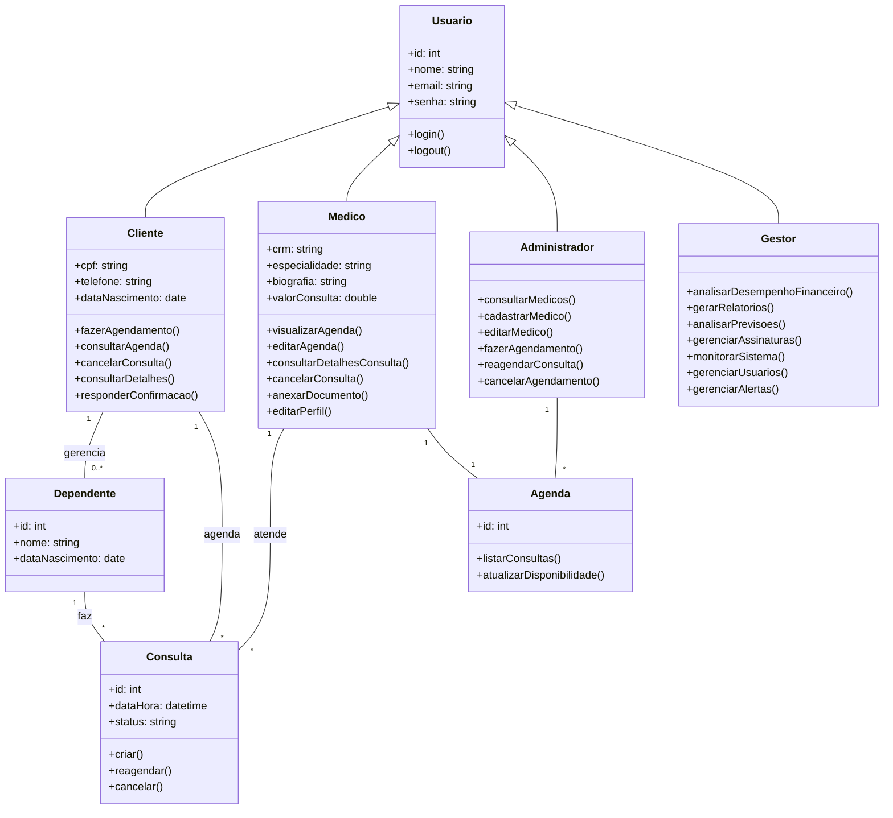

<h1 align="center">SICA - Sistema Integrado para Clínicas e Agendamentos</h1>

  
  
  
  
  
  

  Aplicação mobile para agendamento e gerenciamento de consultas, 
  centralizando informações e facilitando a organização do usuário.

---

## ✦ Sobre o Projeto

O sistema foi desenvolvido com o objetivo de simplificar o processo de agendamento médico, permitindo que usuários encontrem rapidamente clínicas, médicos e horários disponíveis.

Além disso, oferece suporte à gestão de dependentes, envio de encaminhamentos e acompanhamento completo dos compromissos de saúde.

---

## ✦ Persona Principal

  
    
  <strong>Maria Eduarda Oliveira</strong> 
  38 anos • Persona Primária  

 

Responsável por organizar a saúde da família, Maria enfrenta dificuldades com a falta de centralização das informações e com a gestão de múltiplos agendamentos.

**Principais necessidades:**
- Agendamento rápido e simples  
- Visualização clara de horários  
- Lembretes automáticos  

📄 [Ver todas as personas](docs/personas.md)

---

## ✦ Requisitos do Sistema

### Funcionais

| ID   | Descrição |
|------|----------|
| RF01 | Listar clínicas próximas |
| RF04 | Listar médicos disponíveis |
| RF08 | Selecionar data e horário |
| RF11 | Confirmar agendamento |

### Não Funcionais

| ID    | Tipo        | Descrição |
|-------|------------|-----------|
| RNF01 | Segurança  | Criptografia de dados |
| RNF02 | Desempenho | Resposta em até 2s |
| RNF03 | Confiabilidade | Alta disponibilidade |

📄 [Ver requisitos completos](docs/requisitos.md)

---

## ✦ Casos de Uso

### Administrador

**Principais ações:**
- Gerenciar médicos  
- Controlar agenda  
- Reagendar e cancelar consultas  

📄 Acesse os casos de uso completos:
- [Administrador](docs/casos%20de%20uso/administrador.md)  
- [Médico](docs/casos%20de%20uso/medico.md)  
- [Cliente](docs/casos%20de%20uso/paciente.md)  
- [Sistema](docs/casos%20de%20uso/sistema.md)  

---
## ✦ Protótipo

  
  

 

### 🔗 Interfaces do Sistema

- 👤 [Interface Cliente](https://stitch.withgoogle.com/projects/11329770657792360424)  
- 🛠️ [Interface Administrativa](https://stitch.withgoogle.com/projects/3155227529588405910)  
- 🧑‍⚕️ [Interface Médica](https://stitch.withgoogle.com/projects/15991185783286400575)  
- 📊 [Interface Gestor](https://stitch.withgoogle.com/projects/11630288415312253588)

---

## ✦ Diagrama de Classes

---

## ✦ Problemas Abordados

- Falta de organização de consultas
- Dependência de processos manuais  
- Dificuldade em visualizar horários disponíveis  
- Falta de lembretes eficientes  
- Informações descentralizadas  

---

## ✦ Tecnologias

O projeto foi planejado com foco em:

- Database Oracle  
- Expo.dev  

---

## ✦ Vídeo do Projeto

🎥 https://www.youtube.com/watch?v=061SmmCakYc

---

## ✦ Equipe

<table>
  <tr>
    <td align="center">
      <a href="https://github.com/InsaneCaio">
         
        <b>Caio Domingues</b>
      </a>
    </td>
    <td align="center">
      <a href="https://github.com/EmanuelAlmeida27">
         
        <b>Emanuel Almeida</b>
      </a>
    </td>
    <td align="center">
      <a href="https://github.com/gustavo-carvalh0">
         
        <b>Gustavo Carvalho</b>
      </a>
    </td>
    <td align="center">
      <a href="https://github.com/PGLS87">
         
        <b>Paulo Guilherme</b>
      </a>
    </td>
  </tr>
</table>

---

## ✦ Licença

Distribuído sob a licença MIT.  
📄 [Ver licença](LICENSE)
