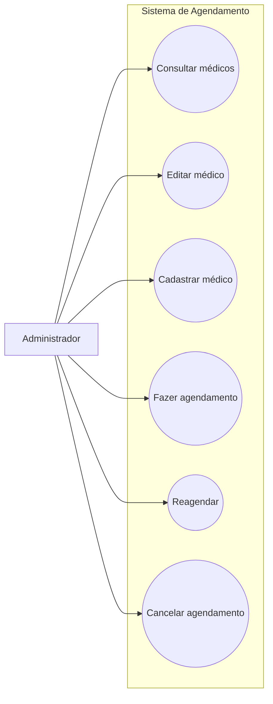

# Casos de Uso - Administrador

Este diagrama representa as interações do administrador com o sistema de agendamento.

## Casos de uso
- Consultar médicos
- Editar médico
- Cadastrar médico
- Fazer agendamento
- Reagendar
- Cancelar agendamento

## Diagrama

