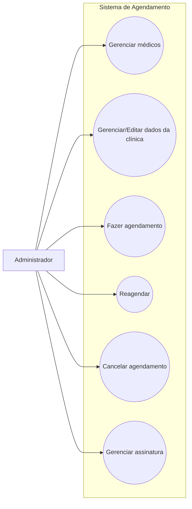

# Casos de Uso - Administrador

Este diagrama representa as interações do administrador com o sistema de agendamento.

## Casos de uso
- Gerenciar médicos
- Gerenciar/Editar dados da clínica
- Fazer agendamento
- Reagendar
- Cancelar agendamento
- Gerenciar assinatura

## Diagrama

