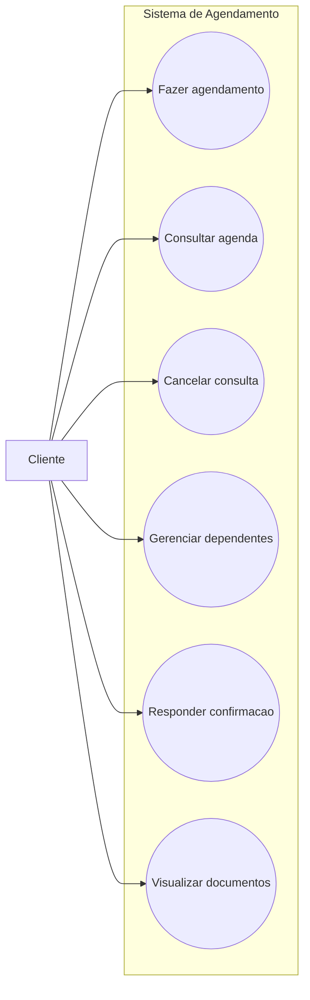

# Casos de Uso - Cliente

Este diagrama representa as interações do cliente com o sistema de agendamento.

## Casos de uso
- Fazer agendamento  
- Consultar agenda  
- Cancelar consulta  
- Gerenciar dependentes  
- Responder confirmação
- Visualizar documentos

## Diagrama

