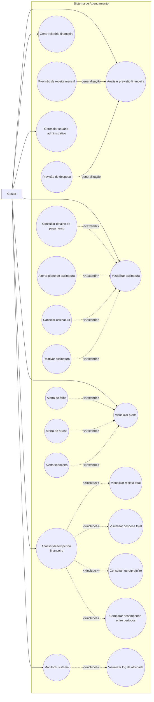

# Casos de Uso - Gestor

Este diagrama representa as interações do gestor com o sistema de agendamento.

## Casos de uso

* Analisar desempenho financeiro
* Gerar relatório financeiro
* Analisar previsão financeira
* Gerenciar assinatura
* Monitorar sistema
* Gerenciar usuário administrativo
* Gerenciar alerta

---

## Diagrama

