# Casos de Uso - Gestor

Este diagrama representa as interações do gestor com o sistema de agendamento.

## Casos de uso

* Visualizar receita total
* Visualizar despesas totais
* Consultar lucro/prejuízo
* Gerar relatórios financeiros
* Visualizar previsão de receita mensal
* Visualizar previsão de despesas
* Comparar desempenho entre períodos
* Visualizar assinaturas ativas
* Consultar detalhes de pagamento por clínica
* Alterar plano de assinatura
* Cancelar assinatura
* Reativar assinatura
* Acessar painel administrativo
* Monitorar funcionamento do sistema
* Visualizar logs de atividades
* Gerenciar usuários administrativos
* Receber alertas de falhas no sistema
* Receber alertas de atrasos
* Receber alertas financeiros

---

## Diagrama

```mermaid
flowchart LR
    G[Gestor]

    subgraph Sistema de Agendamento
        UC1((Visualizar receita total))
        UC2((Visualizar despesas totais))
        UC3((Consultar lucro/prejuizo))
        UC4((Gerar relatorios financeiros))
        UC5((Visualizar previsao de receita mensal))
        UC6((Visualizar previsao de despesas))
        UC7((Comparar desempenho entre periodos))
        UC8((Visualizar assinaturas ativas))
        UC9((Consultar detalhes de pagamento))
        UC10((Alterar plano de assinatura))
        UC11((Cancelar assinatura))
        UC12((Reativar assinatura))
        UC13((Acessar painel administrativo))
        UC14((Monitorar funcionamento do sistema))
        UC15((Visualizar logs de atividades))
        UC16((Gerenciar usuarios administrativos))
        UC17((Receber alertas de falhas))
        UC18((Receber alertas de atrasos))
        UC19((Receber alertas financeiros))
    end

    G --> UC1
    G --> UC2
    G --> UC3
    G --> UC4
    G --> UC5
    G --> UC6
    G --> UC7
    G --> UC8
    G --> UC9
    G --> UC10
    G --> UC11
    G --> UC12
    G --> UC13
    G --> UC14
    G --> UC15
    G --> UC16
    G --> UC17
    G --> UC18
    G --> UC19
```

