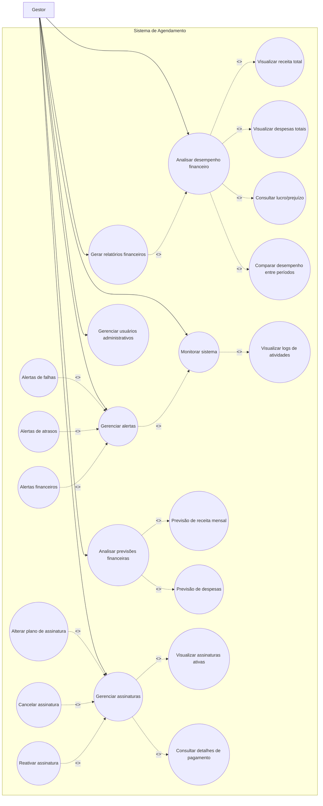

# Casos de Uso - Gestor

Este diagrama representa as interações do gestor com o sistema de agendamento.

## Casos de uso

* Analisar desempenho financeiro
* Gerar relatórios financeiros
* Analisar previsões financeiras
* Gerenciar assinaturas
* Monitorar sistema
* Gerenciar usuários administrativos
* Gerenciar alertas

---

## Diagrama

