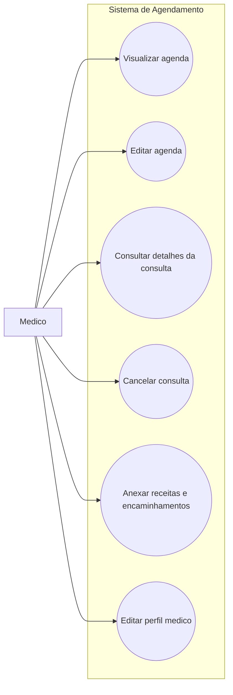

# Casos de Uso - Médico

Este diagrama representa as interações do médico com o sistema de agendamento.

## Casos de uso
- Visualizar agenda
- Editar agenda
- Consultar detalhes da consulta
- Cancelar consulta
- Anexar receitas e encaminhamentos
- Editar perfil médico

## Diagrama

