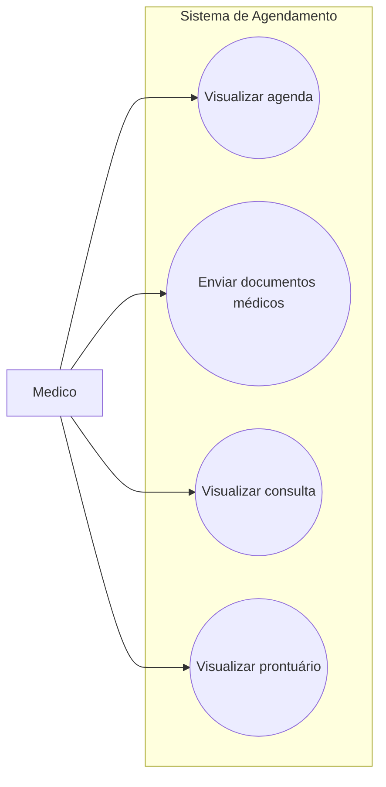

# Casos de Uso - Médico

Este diagrama representa as interações do médico com o sistema de agendamento.

## Casos de uso
- Visualizar agenda
- Enviar documentos médicos
- Visualizar consulta
- Visualizar prontuário

## Diagrama

