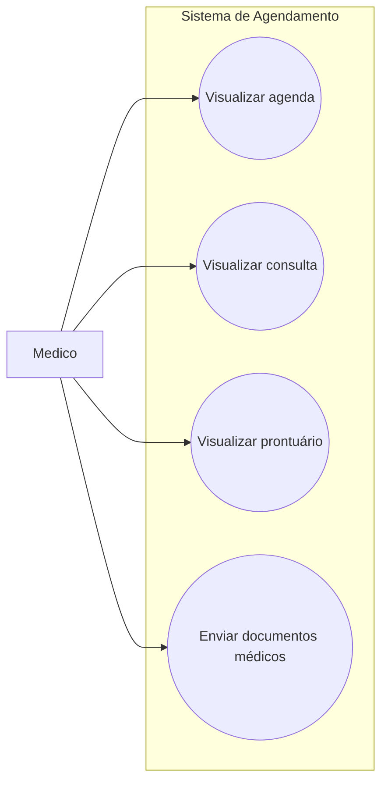

# Casos de Uso - Médico

Este diagrama representa as interações do médico com o sistema de agendamento.

## Casos de uso
- Visualizar agenda
- Visualizar consulta
- Visualizar prontuário
- Enviar documentos médicos

## Diagrama

