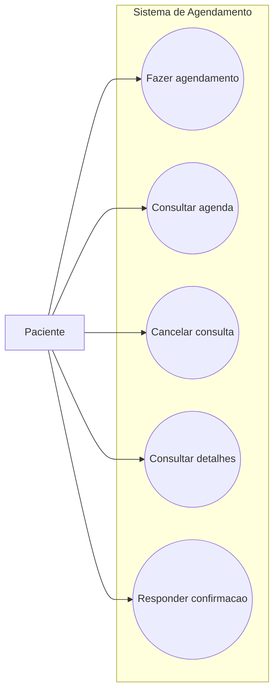

# Casos de Uso - Paciente

Este diagrama representa as interações do paciente com o sistema de agendamento.

## Casos de uso
- Fazer agendamento  
- Consultar agenda  
- Cancelar consulta  
- Consultar detalhes  
- Responder confirmação

## Diagrama

