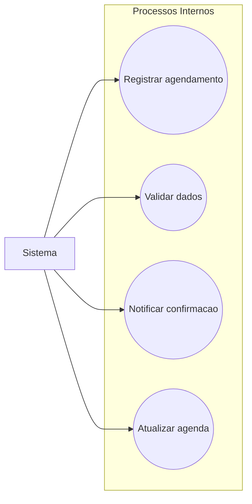

# Casos de Uso - Sistema

Este diagrama representa os processos internos do sistema responsáveis por garantir o funcionamento correto do agendamento de consultas.

## Casos de uso
- Registrar agendamento  
- Validar dados  
- Notificar confirmação  
- Atualizar agenda 

## Diagrama

