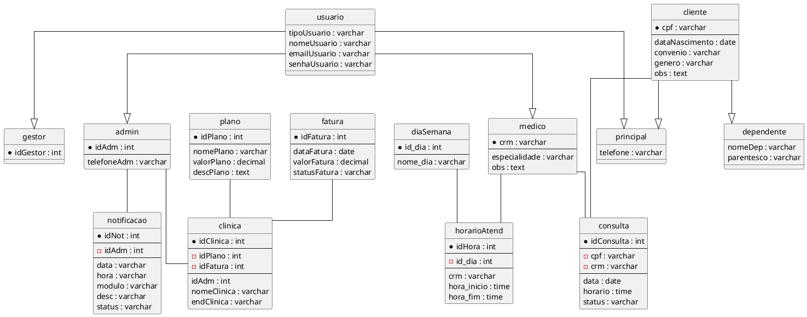

# Diagrama Entidade-Relacionamento

## Código

```plantuml
@startuml

hide circle
skinparam linetype ortho

entity "usuario" as usuario {
    tipoUsuario : varchar
    nomeUsuario : varchar
    emailUsuario : varchar
    senhaUsuario : varchar
}

entity "gestor" as gestor {
    * idGestor : int
}

entity "notificacao" as notificacao {
    * idNot : int
    --
    - idAdm : int
    --
    data : varchar
    hora : varchar
    modulo : varchar
    desc : varchar
    status : varchar
}

entity "admin" as admin {
    * idAdm : int
    --
    telefoneAdm : varchar
}

entity "medico" as medico {
    * crm : varchar
    --
    especialidade : varchar
    obs : text
}

entity "diaSemana" as diaSemana {
    * id_dia : int
    --
    nome_dia : varchar
}

entity "horarioAtend" as horarioAtend {
    * idHora : int
    --
    - id_dia : int
    --
    crm : varchar
    hora_inicio : time
    hora_fim : time
}

entity "cliente" as cliente {
    * cpf : varchar
    --
    dataNascimento : date
    convenio : varchar
    genero : varchar
    obs : text
}

entity "principal" as principal {
    telefone : varchar
}

entity "dependente" as dependente {
    nomeDep : varchar
    parentesco : varchar
}

entity "plano" as plano {
    * idPlano : int
    --
    nomePlano : varchar
    valorPlano : decimal
    descPlano : text
}

entity "clinica" as clinica {
    * idClinica : int
    --
    - idPlano : int
    - idFatura : int
    --
    idAdm : int
    nomeClinica : varchar
    endClinica : varchar
}

entity "fatura" as fatura {
    * idFatura : int
    --
    dataFatura : date
    valorFatura : decimal
    statusFatura : varchar
}

entity "consulta" as consulta {
    * idConsulta : int
    --
    - cpf : varchar
    - crm : varchar
    --
    data : date
    horario : time
    status : varchar
}

' HERANÇA
usuario --|> gestor
usuario --|> admin
usuario --|> medico
usuario --|> principal

cliente --|> principal
cliente --|> dependente

' RELACIONAMENTOS
medico -- horarioAtend
diaSemana -- horarioAtend

plano -- clinica
admin -- clinica
admin -- notificacao
fatura -- clinica

cliente -- consulta
medico -- consulta
@enduml
```
