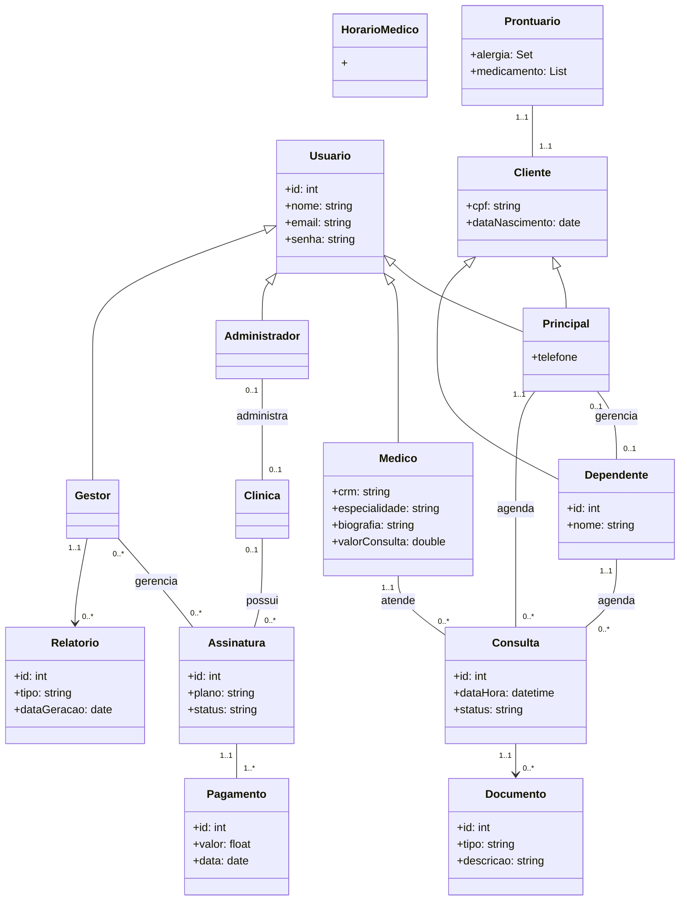

# Diagrama de Classe

```mermaid
classDiagram

%% =======================
%% USUÁRIOS (HERANÇA)
%% =======================

class Usuario {
    +id: int
    +nome: string
    +email: string
    +senha: string
}

class Principal {
    +telefone
}

class Medico {
    +crm: string
    +especialidade: string
    +biografia: string
    +valorConsulta: double
}

class Administrador {
}

class Gestor {
}

Usuario <|-- Principal
Usuario <|-- Medico
Usuario <|-- Administrador
Usuario <|-- Gestor

%% =======================
%% CLIENTE (HERANÇA)
%% =======================

class Cliente {
    +cpf: string
    +dataNascimento: date
}

class Dependente {
    +id: int
    +nome: string
}

Cliente <|-- Principal
Cliente <|-- Dependente

%% =======================
%% RELAÇÃO PACIENTE - DEPENDENTE
%% =======================

Principal "0..1" -- "0..1" Dependente : gerencia


%% =======================
%% CLINICA - RELACIONAMENTOS
%% =======================

class Clinica{
    
}

Administrador "0..1" -- "0..1" Clinica : administra
Gestor "0..*" -- "0..*" Assinatura : gerencia
Clinica "0..1" -- "0..*" Assinatura : possui

%% =======================
%% DISPONIBILIDADE MÉDICO
%% =======================

class HorarioMedico{
    +
}

%% =======================
%% AGENDAMENTO
%% =======================

class Consulta {
    +id: int
    +dataHora: datetime
    +status: string
}

Principal "1..1" -- "0..*" Consulta : agenda
Dependente "1..1" -- "0..*" Consulta : agenda
Medico "1..1" -- "0..*" Consulta : atende

%% =======================
%% PRONTUÁRIO
%% =======================

class Prontuario {
    +alergia: Set<string>
    +medicamento: List<string>
}

Prontuario "1..1" -- "1..1" Cliente

%% =======================
%% DOCUMENTOS MÉDICOS
%% =======================

class Documento {
    +id: int
    +tipo: string
    +descricao: string
}

Consulta "1..1" --> "0..*" Documento

%% =======================
%% ASSINATURA / FINANCEIRO
%% =======================

class Assinatura {
    +id: int
    +plano: string
    +status: string
}

class Pagamento {
    +id: int
    +valor: float
    +data: date
}

Assinatura "1..1" -- "1..*" Pagamento

%% =======================
%% RELATÓRIOS
%% =======================

class Relatorio {
    +id: int
    +tipo: string
    +dataGeracao: date
}

Gestor "1..1" --> "0..*" Relatorio
```
