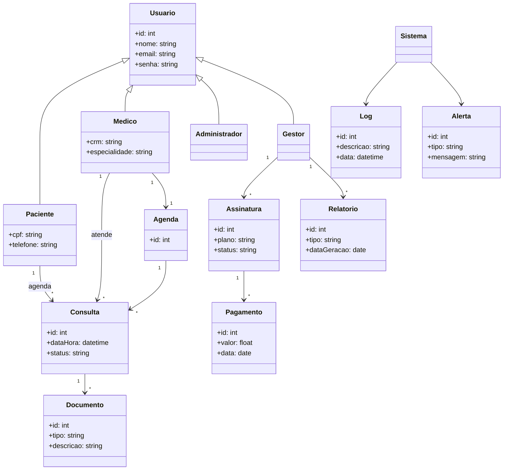

# Diagrama de Classe

```mermaid
classDiagram

%% =======================
%% USUÁRIOS (HERANÇA)
%% =======================

class Usuario {
    +id: int
    +nome: string
    +email: string
    +senha: string
}

class Paciente {
    +cpf: string
    +telefone: string
}

class Medico {
    +crm: string
    +especialidade: string
}

class Administrador {
}

class Gestor {
}

Usuario <|-- Paciente
Usuario <|-- Medico
Usuario <|-- Administrador
Usuario <|-- Gestor

%% =======================
%% AGENDAMENTO
%% =======================

class Consulta {
    +id: int
    +dataHora: datetime
    +status: string
}

class Agenda {
    +id: int
}

Paciente "1" --> "*" Consulta : agenda
Medico "1" --> "*" Consulta : atende

Medico "1" --> "1" Agenda
Agenda "1" --> "*" Consulta

%% =======================
%% DOCUMENTOS MÉDICOS
%% =======================

class Documento {
    +id: int
    +tipo: string
    +descricao: string
}

Consulta "1" --> "*" Documento

%% =======================
%% ASSINATURA / FINANCEIRO
%% =======================

class Assinatura {
    +id: int
    +plano: string
    +status: string
}

class Pagamento {
    +id: int
    +valor: float
    +data: date
}

Assinatura "1" --> "*" Pagamento
Gestor "1" --> "*" Assinatura

%% =======================
%% RELATÓRIOS
%% =======================

class Relatorio {
    +id: int
    +tipo: string
    +dataGeracao: date
}

Gestor "1" --> "*" Relatorio

%% =======================
%% SISTEMA / MONITORAMENTO
%% =======================

class Log {
    +id: int
    +descricao: string
    +data: datetime
}

class Alerta {
    +id: int
    +tipo: string
    +mensagem: string
}

Sistema --> Log
Sistema --> Alerta

class Sistema {
}
```
