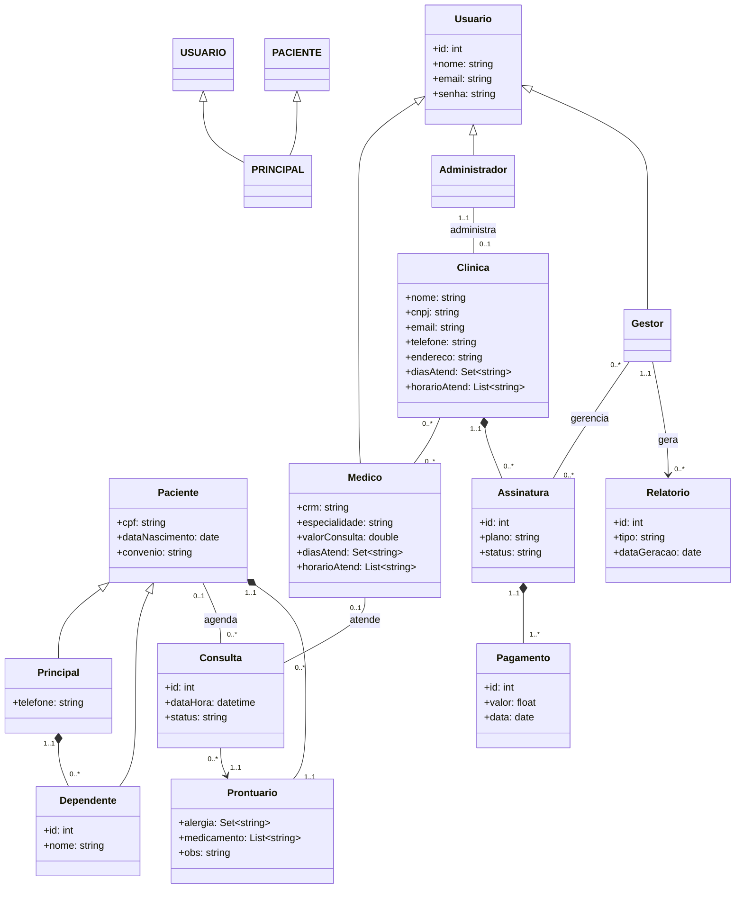

# Diagrama de Classes

```mermaid
classDiagram

class USUARIO
class PACIENTE
class PRINCIPAL

USUARIO <|-- PRINCIPAL
PACIENTE <|-- PRINCIPAL


%% ==================================================
%% PESSOAS
%% ==================================================

class Usuario {
    +id: int
    +nome: string
    +email: string
    +senha: string
}

class Paciente {
    +cpf: string
    +dataNascimento: date
    +convenio: string
}


%% ==================================================
%% USUÁRIOS
%% ==================================================

class Principal {
    +telefone: string
}

class Medico {
    +crm: string
    +especialidade: string
    +valorConsulta: double
    +diasAtend: Set~string~
    +horarioAtend: List~string~
}

class Administrador

class Gestor

Usuario <|-- Medico
Usuario <|-- Administrador
Usuario <|-- Gestor

%% ==================================================
%% PACIENTES
%% ==================================================

class Paciente

class Dependente{
    +id: int
    +nome: string
}

Paciente <|-- Principal
Paciente <|-- Dependente

Principal "1..1" *-- "0..*" Dependente

%% ==================================================
%% ATENDIMENTO
%% ==================================================

class Consulta {
    +id: int
    +dataHora: datetime
    +status: string
}

class Prontuario {
    +alergia: Set~string~
    +medicamento: List~string~
    +obs: string
}

Paciente "0..1" -- "0..*" Consulta : agenda

Medico "0..1" -- "0..*" Consulta : atende

Paciente "1..1" *-- "1..1" Prontuario

Consulta "0..*" --> "1..1" Prontuario

%% ==================================================
%% CLÍNICA
%% ==================================================

class Clinica {
    +nome: string
    +cnpj: string
    +email: string
    +telefone: string
    +endereco: string
    +diasAtend: Set~string~
    +horarioAtend: List~string~
}

Administrador "1..1" -- "0..1" Clinica : administra

Clinica "0..*" -- "0..*" Medico

%% ==================================================
%% FINANCEIRO
%% ==================================================

class Assinatura {
    +id: int
    +plano: string
    +status: string
}

class Pagamento {
    +id: int
    +valor: float
    +data: date
}

Clinica "1..1" *-- "0..*" Assinatura

Assinatura "1..1" *-- "1..*" Pagamento

Gestor "0..*" -- "0..*" Assinatura : gerencia

%% ==================================================
%% RELATÓRIOS
%% ==================================================

class Relatorio {
    +id: int
    +tipo: string
    +dataGeracao: date
}

Gestor "1..1" --> "0..*" Relatorio : gera
```
