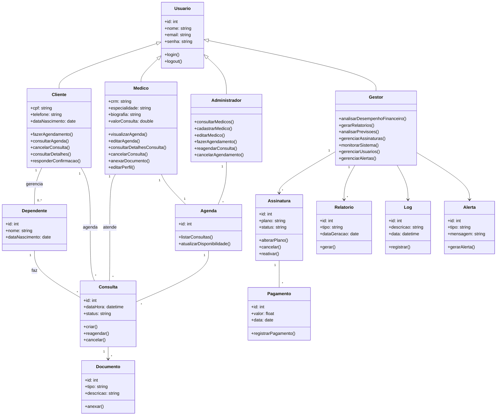

# Diagrama de Classe

```mermaid
classDiagram

%% =======================
%% USUÁRIOS (HERANÇA)
%% =======================

class Usuario {
    +id: int
    +nome: string
    +email: string
    +senha: string
    +login()
    +logout()
}

class Cliente {
    +cpf: string
    +telefone: string
    +dataNascimento: date
    +fazerAgendamento()
    +consultarAgenda()
    +cancelarConsulta()
    +consultarDetalhes()
    +responderConfirmacao()
}

class Dependente {
    +id: int
    +nome: string
    +dataNascimento: date
}

class Medico {
    +crm: string
    +especialidade: string
    +biografia: string
    +valorConsulta: double
    +visualizarAgenda()
    +editarAgenda()
    +consultarDetalhesConsulta()
    +cancelarConsulta()
    +anexarDocumento()
    +editarPerfil()
}

class Administrador {
    +consultarMedicos()
    +cadastrarMedico()
    +editarMedico()
    +fazerAgendamento()
    +reagendarConsulta()
    +cancelarAgendamento()
}

class Gestor {
    +analisarDesempenhoFinanceiro()
    +gerarRelatorios()
    +analisarPrevisoes()
    +gerenciarAssinaturas()
    +monitorarSistema()
    +gerenciarUsuarios()
    +gerenciarAlertas()
}

Usuario <|-- Cliente
Usuario <|-- Medico
Usuario <|-- Administrador
Usuario <|-- Gestor

%% =======================
%% RELAÇÃO PACIENTE - DEPENDENTE
%% =======================

Cliente "1" -- "0..*" Dependente : gerencia

%% =======================
%% AGENDAMENTO
%% =======================

class Consulta {
    +id: int
    +dataHora: datetime
    +status: string
    +criar()
    +reagendar()
    +cancelar()
}

class Agenda {
    +id: int
    +listarConsultas()
    +atualizarDisponibilidade()
}

Cliente "1" -- "*" Consulta : agenda
Dependente "1" -- "*" Consulta : faz
Medico "1" -- "*" Consulta : atende

Medico "1" -- "1" Agenda
Administrador "1" -- "*" Agenda
Agenda "1" -- "*" Consulta

%% =======================
%% DOCUMENTOS MÉDICOS
%% =======================

class Documento {
    +id: int
    +tipo: string
    +descricao: string
    +anexar()
}

Consulta "1" --> "*" Documento

%% =======================
%% ASSINATURA / FINANCEIRO
%% =======================

class Assinatura {
    +id: int
    +plano: string
    +status: string
    +alterarPlano()
    +cancelar()
    +reativar()
}

class Pagamento {
    +id: int
    +valor: float
    +data: date
    +registrarPagamento()
}

Assinatura "1" -- "*" Pagamento
Gestor "1" --> "*" Assinatura

%% =======================
%% RELATÓRIOS
%% =======================

class Relatorio {
    +id: int
    +tipo: string
    +dataGeracao: date
    +gerar()
}

Gestor "1" --> "*" Relatorio

%% =======================
%% SISTEMA / MONITORAMENTO
%% =======================

class Log {
    +id: int
    +descricao: string
    +data: datetime
    +registrar()
}

class Alerta {
    +id: int
    +tipo: string
    +mensagem: string
    +gerarAlerta()
}

Gestor --> Log
Gestor --> Alerta

```
